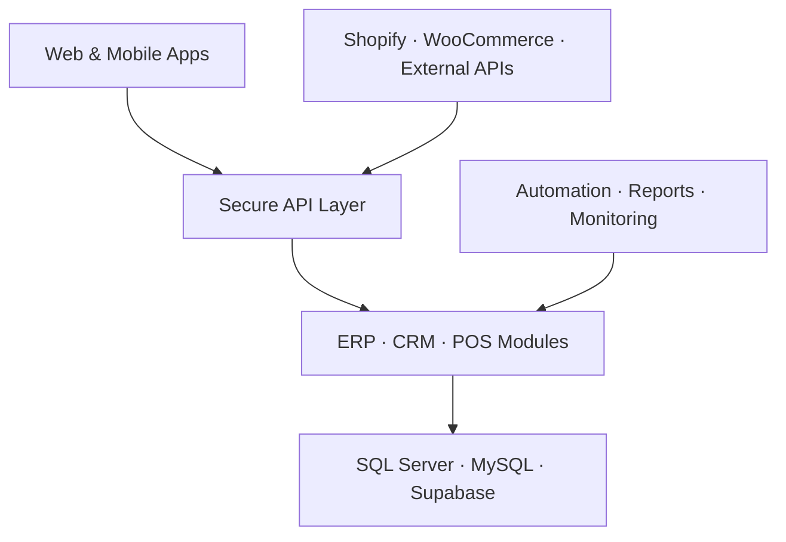

<div align="center">


[](https://git.io/typing-svg)

[](https://github.com/sarfaraz-ahmad-sa)
[](https://github.com/sarfaraz-ahmad-sa?tab=followers)
[](https://www.linkedin.com/in/sarfaraz-ahmad-511a46238)
[](mailto:sarfaraza19990@gmail.com)

</div>

---

## About Me

I'm a **Full-Stack Developer and Team Lead** with **5+ years of experience** building secure, scalable, and business-focused software. For more than **4 years**, I have also led development teams, coordinated releases, reviewed code, and supported production-critical systems.

My strongest area is turning complex business workflows into reliable software—especially **multi-branch ERP, CRM, POS, inventory, finance, reporting, mobile apps, and system integrations**.

- 🔭 Building enterprise-grade **ERP, CRM, POS, and SaaS products**
- 👥 Leading developers and managing production releases
- ⚙️ Designing APIs, database workflows, automation, and integrations
- 📱 Developing cross-platform mobile applications with Flutter
- 🧠 Focused on clean architecture, performance, security, and maintainability
- 📍 Based in Karachi, Pakistan

## At a Glance

<div align="center">

| 5+ Years | 4+ Years Leading | Enterprise Focus | Full Product Delivery |
| :---: | :---: | :---: | :---: |
| Software engineering | Development teams | ERP · CRM · POS · SaaS | Web · API · Mobile · Database |

</div>

## Core Skills

| Priority | Skills |
| --- | --- |
| **Primary Expertise** | PHP, Laravel, SQL Server, REST APIs, ERP/CRM/POS Architecture, Team Leadership |
| **Strong Product Skills** | Flutter, Dart, React.js, JavaScript, MySQL, Supabase, Firebase |
| **Framework Experience** | CodeIgniter, Yii, jQuery, Python, .NET |
| **Business Integrations** | Shopify, WooCommerce, JSON/XML APIs, POS Sync, Multi-tenant Workflows |
| **Operations & Delivery** | Git, Code Review, CI/CD, Staging, Production Releases, Performance Monitoring |

## Technology Stack

### Backend & APIs


### Frontend & Mobile


### Databases & Cloud


### Platforms, Reporting & Delivery


## Professional Expertise

```text
Enterprise Systems   ERP · CRM · POS · Inventory · Accounts · Finance · HR · Sales
Backend Engineering  REST APIs · Integrations · Multi-tenant Systems · Automation
Database Engineering Stored Procedures · Triggers · Views · Query Optimization
Mobile Development   Flutter · Android · iOS · Firebase · Supabase
Release Engineering  Git Workflows · Staging · Deployment · Monitoring · Support
Team Leadership      Planning · Mentoring · Code Review · Releases · Coordination
```

## Engineering Impact

- Built and enhanced business modules across **sales, inventory, dispatch, accounts, finance, HR, and reporting**
- Delivered **multi-branch ERP and POS workflows** with reliable synchronization and business-rule validation
- Designed and integrated **REST APIs**, JSON/XML services, Shopify, WooCommerce, and third-party platforms
- Improved large SQL Server workloads using **stored procedures, views, triggers, indexing, and query optimization**
- Managed controlled delivery from **development → staging → verification → production**
- Shipped and maintained Flutter applications across **Android and iOS**

## Business Domains

`ERP` · `CRM` · `POS` · `Sales` · `Inventory` · `Dispatch` · `Accounts` · `Finance` · `HR` · `Payroll` · `eCommerce` · `School Management` · `Reporting` · `Workflow Automation`

## How I Build Systems



## Featured Work

| Project | What it demonstrates | Core technologies |
| --- | --- | --- |
| 🏢 **Enterprise ERP & POS** | Multi-branch sales, inventory, dispatch, accounts, reporting, and integrations | PHP, Laravel, SQL Server, REST APIs |
| 🎓 **School Management SaaS** | Role-based multi-school platform with dashboards, reports, and scalable data architecture | Flutter Web, Supabase, Firebase |
| 📺 **JinnTV** | Cross-platform entertainment application with analytics integrations | Flutter, Dart, APIs |
| 💙 **iCare** | Production mobile application for Android and iOS | Flutter, Dart, Firebase |
| 💰 **KhataNova** | Personal finance, budgeting, savings, loans, and Khata management | Flutter, Supabase |

> Some enterprise projects are private because they contain client-owned business logic and production data. Architecture and feature walkthroughs can be shared when appropriate.

## GitHub Activity

<div align="center">


</div>

## What I'm Working On

- Improving ERP and CRM performance for high-volume business operations
- Building scalable SaaS products with secure role-based access
- Automating development, testing, deployment, and reporting workflows
- Exploring local AI-assisted development and private LLM infrastructure

## Let's Connect

I'm open to **Senior Full-Stack**, **Backend Engineering**, **Software Development Lead**, and enterprise application opportunities.

<div align="center">

[](mailto:sarfaraza19990@gmail.com)
[](https://www.linkedin.com/in/sarfaraz-ahmad-511a46238)
[](https://github.com/sarfaraz-ahmad-sa)

### “I build software that makes complex business operations simpler.”


</div>
