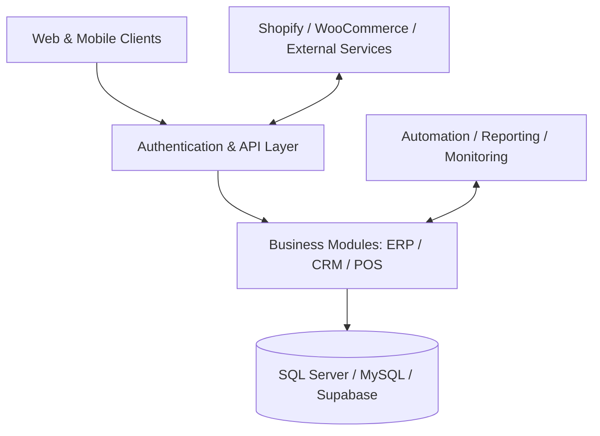

<!-- GitHub Profile README | Repository name: sarfaraz-ahmad-sa -->

**Karachi, Pakistan** · Open to Senior Full-Stack, Backend Engineering & Software Development Lead opportunities

---

## 👨‍💻 About Me

I’m a **Full-Stack Developer & Team Lead with 6+ years of software engineering experience**, including **4+ years in development leadership**. I design, build and maintain business-critical platforms, with a focus on **ERP, CRM, POS, multi-branch operations and SaaS**.

My work spans backend architecture, database engineering, web and mobile development, integration, team coordination and production delivery. I enjoy translating complex workflows into secure, maintainable and practical software.

- 🏢 Build ERP/CRM/POS modules for sales, inventory, dispatch, accounts, finance and reporting.
- 🧩 Engineer REST APIs, third-party integrations, multi-tenant workflows and automation.
- 🗄️ Optimize SQL Server/MySQL queries, stored procedures, views, triggers and indexes.
- 📱 Deliver cross-platform mobile products using Flutter and Dart.
- 👥 Lead code reviews, releases, environment coordination and developer mentoring.
- 🎯 Prioritize maintainability, performance, business correctness and dependable delivery.

## 🛠️ Technology Stack

**Backend & APIs**

      

**Frontend & Mobile**

      

**Databases, Cloud & Backend Services**

   

**Tools, Platforms & Integrations**

      

`Microsoft Dynamics` · `Perfex CRM` · `JSON/XML` · `Windows Server` · `CI/CD` · `Staging & Deployment`

## 🧠 Areas of Expertise

| Focus | What I work on |
| :--- | :--- |
| **Enterprise Applications** | ERP, CRM, POS, inventory, sales, dispatch, accounts, finance, HR |
| **Backend Engineering** | API design, validation, business rules, integrations, workflow automation |
| **Database Engineering** | Stored procedures, triggers, views, query optimization, reporting |
| **Mobile Development** | Flutter, Android, iOS, Firebase and Supabase integrations |
| **Delivery & Leadership** | Development planning, code reviews, staging, deployments, production support |

## 🚀 Selected Work

| Project | Highlights | Stack |
| :--- | :--- | :--- |
| **Enterprise ERP & POS** | Multi-branch sales, inventory, dispatch, accounts, reporting and third-party integration | PHP, Laravel, SQL Server, APIs |
| **School Management SaaS** | Multi-school workflows, role-based access, dashboards and reporting | Flutter Web, Supabase, Firebase |
| **JinnTV** | Cross-platform entertainment app and analytics integration | Flutter, Dart, REST APIs |
| **iCare** | Mobile application development and release management | Flutter, Dart, Firebase |
| **KhataNova** | Finance, budgeting, saving, loans and khata workflows | Flutter, Supabase |
| **CRM & Reporting Automation** | Scheduled data preparation, report generation and exports | Python, SQL Server, CRM |

> **Note:** Some enterprise/client repositories are private. I can discuss their architecture and my contributions without disclosing proprietary code or production data.

## ⚙️ How I Approach Architecture

```mermaid
flowchart TD
  A[Web & Mobile Clients] --> B[Authentication & API Layer]
  B --> C[Business Modules: ERP / CRM / POS]
  C --> D[(SQL Server / MySQL / Supabase)]
  E[Shopify / WooCommerce / External Services] <--> B
  F[Automation / Reporting / Monitoring] <--> C
```

## 📈 GitHub Activity

> Public-repository statistics may not reflect private client work. These visualizations are provided by third-party services and depend on their availability.

## 🔭 Currently Exploring

- Faster, scalable ERP/CRM workflows and reporting automation.
- SaaS platforms with secure multi-tenant and role-based architecture.
- AI-assisted engineering and private/local LLM infrastructure.
- Reliable development → staging → production release processes.

## 🤝 Let's Connect

Interested in collaborating on **enterprise software, backend/API engineering, ERP/CRM/POS integrations, mobile apps or SaaS products**? Get in touch.

**“I build software that makes complex business operations simpler.”**

