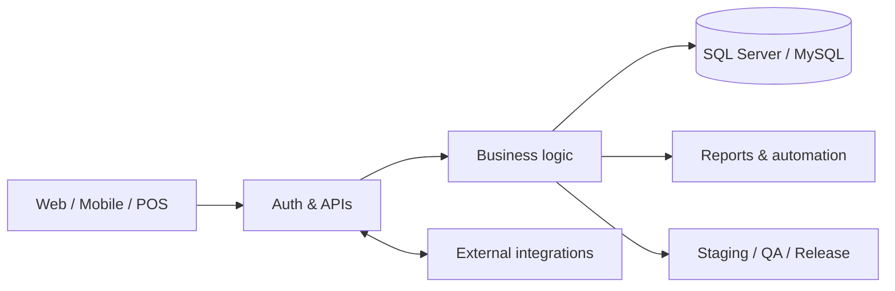

<!--
  GitHub Profile README
  Place this file in: github.com/sarfaraz-ahmad-sa/sarfaraz-ahmad-sa
  Update experience figures and project descriptions as your career evolves.
-->

 

  

**📍 Karachi, Pakistan** &nbsp; • &nbsp; **Open to Senior Full-Stack / Backend / Development Lead roles**

---

### 👋 The person behind the code

I’m **Sarfaraz Ahmad**, a **Full-Stack Developer and Team Lead** with **6+ years in software engineering** and **4+ years in development leadership**. I specialize in turning complex business operations into dependable applications — from database design and secure APIs to polished interfaces, mobile experiences and production releases.

My focus is **enterprise software**: ERP, CRM, POS, inventory, finance, multi-branch operations, third-party integrations and workflow automation. I work across the stack, but I care most about solving the right problem, keeping systems maintainable and helping teams ship with confidence.

<table>
<tr>
<td width="50%" valign="top">

**🔨 What I build**

- Enterprise ERP / CRM / POS solutions
- REST APIs and system integrations
- Multi-tenant SaaS and business workflows
- Flutter applications for Android and iOS
- Reporting, synchronization and automation

</td>
<td width="50%" valign="top">

**🧭 How I work**

- Translate requirements into reliable solutions
- Design and optimize SQL-backed systems
- Review code and mentor developers
- Coordinate staging and production releases
- Balance performance, security and usability

</td>
</tr>
</table>

### ⚡ Toolbox

**Languages & frameworks**

**Databases & services**

&nbsp;

**Tools & platforms**

&nbsp;

**Additional experience:** CodeIgniter · Yii · jQuery · Shopify · WooCommerce · Microsoft Dynamics · Perfex CRM · JSON/XML APIs · Windows Server · CI/CD

---

### 🏗️ Engineering specializations

| Area | Experience |
| :-- | :-- |
| **Enterprise systems** | Sales, inventory, dispatch, accounts, finance, HR, ERP/CRM/POS workflows |
| **Backend & integrations** | PHP/Laravel, REST APIs, JSON/XML, eCommerce integrations, business-rule validation |
| **Data engineering** | SQL Server, MySQL, stored procedures, triggers, views, indexing and query optimization |
| **Web & mobile** | React, JavaScript, Flutter, Firebase and Supabase |
| **Technical leadership** | Planning, mentoring, code reviews, staging, deployment and production support |

### 🚀 Selected projects & product experience

<!-- Add public repository or live-demo links only when they are available and appropriate to share. -->

| Product / initiative | What it demonstrates | Technology |
| :-- | :-- | :-- |
| **Enterprise ERP & POS** | Multi-branch sales, inventory, dispatch, accounts and integrations | PHP · Laravel · SQL Server · APIs |
| **School Management SaaS** | Multi-school workflows, role-based access, dashboards and reporting | Flutter Web · Supabase · Firebase |
| **JinnTV** | Cross-platform application and analytics integration | Flutter · Dart · APIs |
| **iCare** | Mobile application development and release workflows | Flutter · Dart · Firebase |
| **KhataNova** | Personal finance, budgets, savings, loans and khata flows | Flutter · Supabase |
| **CRM & Report Automation** | Scheduled data preparation, reporting and exports | Python · SQL Server · CRM |

> 🔒 Some enterprise projects are client-owned or private. I can share architectural approaches and discuss my contributions without exposing proprietary code or production data.

### 🔄 From idea to production

```mermaid
flowchart LR
  U[Web / Mobile / POS] --> A[Auth & APIs]
  A --> B[Business logic]
  B --> D[(SQL Server / MySQL)]
  A <--> I[External integrations]
  B --> R[Reports & automation]
  B --> O[Staging / QA / Release]
```

---

### 📊 GitHub at a glance

 

 

These widgets use third-party services. Public GitHub statistics do not represent all private/client work.

---

### 🎯 Current interests

- Improving **ERP/CRM reliability and performance** at scale.
- Building **multi-tenant SaaS** with thoughtful permissions and maintainable architecture.
- Automating repeatable **database, reporting and deployment workflows**.
- Exploring **private/local AI** to support software teams.

### 🤝 Let's build something useful

Open to discussing **senior engineering opportunities, enterprise applications, SaaS products, integrations and technical collaboration**.

  

**“I build software that makes complex business operations simpler.”**

